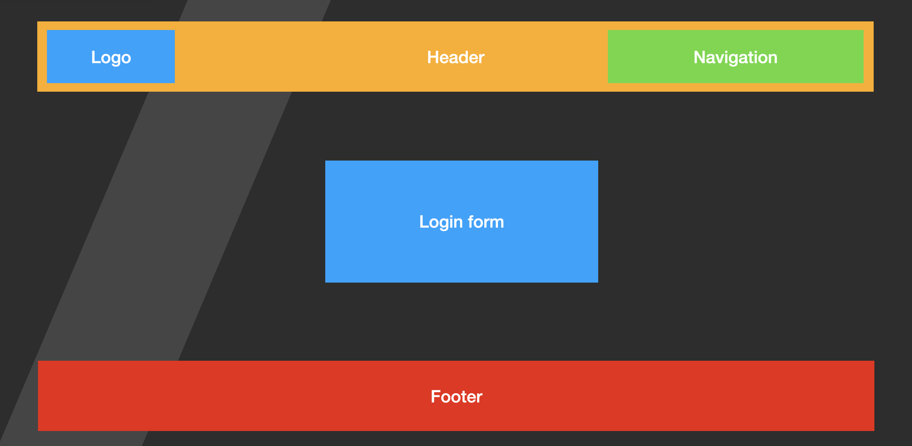

# Basic HTML development and typescript

In this folder we will give different example of javascript and typescript.  

## Javascript

Javascript is a prerequisite for this course.  
We will go over advanced js features before covering them in the lesson.  
These are the topics you need to know in Javascript for this course:

- Variables declarations: `let`, `const`, `var`
- different if's
- different loops
- functions
- oop
- modules
- Promises

## EX.

- create a new folder called `basic-layout`
- open vscode in the folder you created
- create a new file `index.html`
- connect that file to a `css` file
- in that file create the following layout



```html
<div>

<a>
<form>
<input>
<footer>
```

```CSS
.some-container {
	display: flex;
}

```